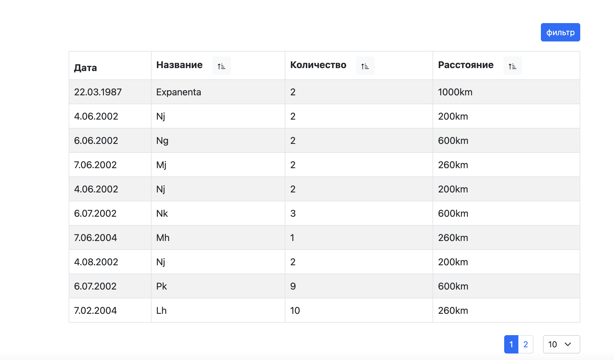

# tables-react



## About:

This application renders the data received from the server in a table. 

The table has a sorting method, filtering and pagination. 

All of the above methods are implemented on the server side through queries to the postgresql database.

The application is wrapped in a docker container, in order to run it locally, make sure that Docker is installed on your computer.

Below are detailed startup instructions


## Quick start:

- Clone a repository

```
https://github.com/Sergey-Shar/tables-react.git
```

- Install dependencies client

```
cd client
```

```
yarn install
```
```
cd ..
```
- Install dependencies server

```
cd server
```
```
npm install
```
```
cd ..
``

- Start App

```
npm run start
```

- Open in the browser

```
http://localhost:3000/
```

## Tools:

 Client:
- [React](https://ru.reactjs.org/)
- [TypeScript](https://www.typescriptlang.org/)
- [Redux-toolkit](https://redux-toolkit.js.org/)
- [React-bootstrap](https://react-bootstrap.netlify.app/)

 Server:
- [Node.js](https://nodejsdev.ru/)
- [TypeScript](https://www.typescriptlang.org/)
- [Express](https://expressjs.com/ru/)

 DB:
- [PostgreSQL](https://www.postgresql.org/)

 Containers:
- [Docker](https://www.docker.com/)

##


